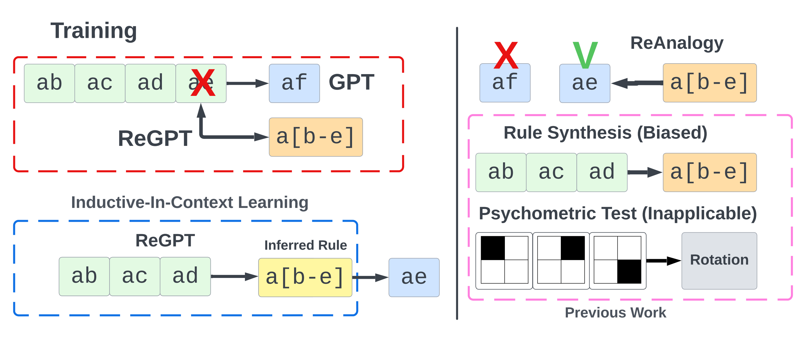

# ReGPT

### Probing Reasoning of Language Models with Inductive In-Context Learning

ReGPT is used to evaluate the hypothesis of learning to associate Facts (in this case are examples that match a regex) to Rules (in this case it is a Regex). The advantage of ReGPT over previous evaluation methods is that there is a ground-truth on whether a Fact can be described by a Rule (for example we can evaluate membership via `re.match`).




## Description
Illustration on the differences between our approach in Training (**left**) and Evaluating (**right**) as compared to previous methods. For ReGPT we inject a <span style="color:orange">**Rule**</span> (`R`) during training (bottom row of the red outline) as compared to GPT that is trained with additional <span style="color:green">**Facts**</span> (`F`). Previous approaches directly optimize for a Rule synthesis task (biased) or use tests that can be inapplicable for LMs (pink outline). During evaluation, we probe ReGPT with **Inductive In-Context Learning** (blue outline) to  <span style="color:yellow">**infer a Rule**</span> ($\hat{R}$) from Facts that we use to generate additional Facts (blue tokens). ReAnalogy evaluate whether the <span style="color:blue">**generated Facts**</span> abide by the ground-truth Rule. Our benchmark can implicitly evaluate on whether a model has learned to infer the underlying Rules as opposed to explicitly evaluate a model optimized for `Rule Synthesis`. For Inductive In-Context Learning the soundness of the Rule is unambiguous and as such it improves performance when compared to a baseline model.


## Usage

### Install
1. `git clone https://github.com/fostiropoulos/regpt`
2. `pip install -e regpt`

### Train

```bash
python -m regpt  \
[--dataset {reanalogy,deep,kb13}] \
--dataset_path DATASET_PATH \ # location of ReAnalogy
--save_path SAVE_PATH \
[--regpt] \ # ReGPT vs GPT
[--n_examples {2,5,8,12}] \
[--n_layers {2,6,24}] \
[--batch_size BATCH_SIZE] \
[--device {cuda:0,cuda:1,cpu}] \
[--resume]
```

### Evaluate

```python
from regpt.compiler import Compiler
# chkpt_path must be ReGPT_***.pt saved in the SAVE_PATH
c = Compiler(dataset_path, chkpt_path)
c.evaluate(n_samples=1)
```

### ReAnalogy

[ReAnalogy](https://github.com/fostiropoulos/ReAnalogy) is a dataset composed of regular expressions that is used to train ReGPT.


## Cite

```bibtex
@inproceedings{fostiropoulos2023probing,
  title={Probing Reasoning of Language Models with Inductive In-Context Learning},
  author={Fostiropoulos, Iordanis and Itti, Laurent},
  booktitle={International Joint Conference on Artificial Intelligence 2023 Workshop on Knowledge-Based Compositional Generalization},
  year={2023}
}
```
